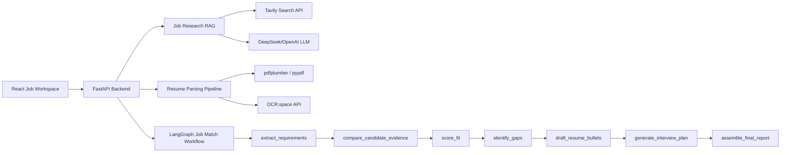

# Job Search Copilot

一个面向求职场景的 AI Agent 工作台，用来分析简历与岗位的匹配度、检索候选人证据、识别能力缺口、生成有证据约束的简历 bullet，并准备面试问题。

项目定位为可以写进简历和作品集的 Agent 系统。当前版本没有 LLM API key 也能用本地确定性逻辑运行；配置 API 后可以接入 DeepSeek/OpenAI、OCR、联网岗位研究和监督式评估。

## 为什么做这个项目

求职不是一次性问答，而是一个持续流程：

- 每个岗位都需要针对性分析 JD。
- 每次投递都需要基于证据判断匹配度。
- 简历 bullet、cover letter、面试故事不能编造经历。
- 上传简历、OCR、字段清洗、人工确认、联网资料和评估指标都需要工程化处理。

因此它比普通聊天机器人更适合作为 Agent 项目展示。

## 架构



## 当前能力

- 简历、岗位描述和补充项目材料输入
- `.txt`、`.md`、`.pdf` 简历上传
- PDF 文本层解析、layout-aware 解析、OCR fallback
- OCR 结果可通过 LLM 清洗为纯文本
- DeepSeek/OpenAI 可选 API 生成
- Tavily Search API 岗位研究 RAG
- 分析历史记录，保存到浏览器 `localStorage`
- LLM JSON schema 校验、自动修复和 fallback
- 一键生成简历修改建议与求职信草稿
- 匹配分、已匹配关键词、缺失关键词
- 简历证据片段和来源标注
- 能力缺口建议
- 有证据约束的简历 bullet 草稿
- 面试准备问题
- 简历解析监督评估指标

## 本地运行

### Backend

```powershell
cd "D:\Python\Job Search Copilot\job-search-copilot\backend"
python -m venv .venv
.\.venv\Scripts\Activate.ps1
pip install -e ".[dev]"
uvicorn app.main:app --reload
```

默认 API 地址：

```text
http://127.0.0.1:8000
```

当前开发中也使用过：

```text
http://127.0.0.1:8010
```

### Frontend

```powershell
cd "D:\Python\Job Search Copilot\job-search-copilot\frontend"
npm install
npm run dev
```

UI 地址：

```text
http://127.0.0.1:5173
```

## 配置

复制环境变量模板：

```powershell
cd "D:\Python\Job Search Copilot\job-search-copilot"
Copy-Item .env.example .env
```

DeepSeek 配置：

```text
LLM_PROVIDER=deepseek
DEEPSEEK_API_KEY=your_deepseek_api_key_here
DEEPSEEK_MODEL=deepseek-v4-flash
DEEPSEEK_BASE_URL=https://api.deepseek.com
USE_LLM=true
```

OpenAI 配置：

```text
LLM_PROVIDER=openai
OPENAI_API_KEY=your_openai_api_key_here
OPENAI_MODEL=gpt-4.1-mini
USE_LLM=true
```

OCR 配置：

```text
OCR_SPACE_API_KEY=your_ocr_space_key_here
OCR_SPACE_ENDPOINT=https://api.ocr.space/parse/image
OCR_SPACE_ENGINE=3
OCR_MIN_TEXT_CHARS=300
```

岗位研究 RAG 配置：

```text
TAVILY_API_KEY=your_tavily_api_key_here
TAVILY_ENDPOINT=https://api.tavily.com/search
```

修改 `.env` 后需要重启后端。前端右上角会显示当前是 `本地模式`、`OpenAI API` 还是 `DeepSeek API`。

## 简历上传与 OCR

前端支持上传 `.txt`、`.md`、`.pdf`。

- `.txt` 和 `.md` 在浏览器中直接读取，然后进入解析预览。
- `.pdf` 会发送到后端 `/parse-resume`。
- 后端优先使用 `pdfplumber` 做 layout-aware PDF 提取。
- 如果 layout-aware 提取不足，会回退到 `pypdf` 文本层提取。
- 如果文本层内容过少，会判定为扫描 PDF，并调用 OCR.space API。
- OCR 结果可以继续交给当前 LLM provider，例如 DeepSeek，清洗成适合 Agent 分析的纯文本。
- 解析结果不会直接覆盖简历输入框，而是先进入人工确认流程。

## 岗位研究 RAG

前端在分析结果中提供“联网研究岗位”按钮。

流程：

1. 使用 `company`、`role_title` 和 `job_description` 构造搜索 query。
2. 后端调用 Tavily Search API 获取近期网络资料。
3. 后端按岗位关键词做轻量重排，保留最相关来源。
4. LLM 只基于 JD、简历和 `sources` 输出结构化 JSON。
5. 前端展示 `research_summary`、`company_signals`、`role_signals`、`resume_positioning_advice`、`interview_strategy` 和资料来源链接。

如果没有配置 `TAVILY_API_KEY`，接口会返回 warning，并降级为基于 JD 的本地建议，不伪造网络时效信息。

## 历史记录

完成一次 `/analyze` 后，前端会自动保存一条记录到浏览器 `localStorage`。

保存内容包括：

- `company`
- `role_title`
- `resume_text`
- `job_description`
- `supplemental_materials`
- `AnalyzeResponse`
- 可选的 `JobResearchResponse`

当前最多保存 12 条记录。用户可以恢复、删除或清空历史记录。

## 简历解析评估

解析质量通过轻量监督 fixture 评估：

```text
backend/fixtures/resume_parsing/
  sample_01/
    expected.txt
    parsed.txt
    metadata.json
```

运行评估：

```powershell
cd "D:\Python\Job Search Copilot\job-search-copilot\backend"
.\.venv\Scripts\python.exe -m app.eval_parsing
```

指定样本并查看诊断：

```powershell
.\.venv\Scripts\python.exe -m app.eval_parsing --sample sample_03 --show-diff
```

指标说明：

- `char_recall`：解析文本相对人工校准文本的近似召回。
- `keyword_recall`：必需关键词召回。
- `section_recall`：必需简历章节标题召回。
- `truncated`：是否疑似截断或缺失尾部内容。

## 指标变化记录

### sample_03: 真实简历 PDF

发现的问题：

- 解析结果被评估为疑似截断。
- 必需关键词召回较低。
- 诊断后发现，一部分问题来自监督 metadata 不准确，另一部分来自原截断检测不适合中文文本。

Iteration 14 的修复：

- 增加解析诊断：缺失关键词、缺失章节、缺失尾部片段、`expected tail` 和 `parsed tail`。
- 将基于空格 token 的截断检测替换为 CJK n-gram tail recall。
- 修正 `sample_03` 的必需关键词，使其匹配简历中真实存在的技能。
- 调整 PDF candidate selection，让简历类布局在内容足够完整时优先使用 layout-aware extraction。

量化对比：

| 指标 | 优化前 | 优化后 | 变化 |
|---|---:|---:|---:|
| `keyword_recall` | 0.50 | 1.00 | 绝对提升 +0.50，相对提升 +100% |
| `section_recall` | 1.00 | 1.00 | 保持稳定 |
| `truncated` | true | false | 已修复 |
| `parsed_chars` | 945 | 945 | 无变化 |
| `expected_chars` | 886 | 886 | 无变化 |

结论：

- 关键词覆盖率从 50% 提升到 100%。
- 截断误判已修复。
- 章节识别保持 100%。
- 后续主要优化方向是提升 `char_recall`，例如清理少量 `(cid:...)` artifact 和布局空格差异。

## API 示例

```powershell
Invoke-RestMethod `
  -Uri "http://127.0.0.1:8000/analyze" `
  -Method Post `
  -ContentType "application/json" `
  -Body (@{
    resume_text = "Python engineer with FastAPI, React, Docker, Postgres, RAG, and AI agent experience."
    job_description = "Hiring an AI Engineer with Python, FastAPI, LangGraph, RAG, Docker, and Postgres."
    company = "ExampleCo"
    role_title = "AI Engineer"
  } | ConvertTo-Json)
```

岗位研究：

```powershell
Invoke-RestMethod `
  -Uri "http://127.0.0.1:8000/research-job" `
  -Method Post `
  -ContentType "application/json" `
  -Body (@{
    company = "ExampleCo"
    role_title = "AI Engineer"
    resume_text = "Built FastAPI and LangGraph agent workflows."
    job_description = "Need Python, FastAPI, LangGraph, RAG, and production API experience."
    supplemental_materials = "Portfolio includes OCR, LLM cleaning, and parsing evaluation."
  } | ConvertTo-Json)
```

## 作品集表达

可以这样描述这个项目：

构建了一个多节点 Agent 求职工作台，用于分析简历与岗位的匹配度、检索候选人证据、识别能力缺口、生成有证据约束的简历 bullet，并准备面试问题。项目实现了 FastAPI 后端、React 工作台、LangGraph workflow、混合 PDF/OCR 解析 pipeline、DeepSeek/OpenAI provider 支持、联网岗位研究 RAG、浏览器本地历史记录，以及监督式简历解析评估。

## 下一步计划

1. 用 LlamaIndex 建立候选人资料库，接入简历、项目经历、GitHub README 和公司笔记。
2. 将当前 lexical evidence retriever 替换成 LlamaIndex vector retrieval。
3. 加入 OpenAI Agents SDK tracing、guardrails 和 structured outputs。
4. 加入岗位收藏、投递状态和 follow-up 看板。
5. 加入生成质量评估，包括 bullet 是否有证据支撑、是否夸大经历、是否符合岗位。

## 迭代记录

### Iteration 0: 开源项目调研

- 对比 LangGraph、LlamaIndex、OpenAI Agents SDK、CrewAI、OpenHands、Google ADK、Semantic Kernel 和 AutoGen。
- 选择 LangGraph 作为 workflow 主干，LlamaIndex 作为后续检索层，OpenAI Agents SDK 作为后续 agent execution、guardrail 和 tracing 层。
- 将参考源码下载到 `D:\Python\Job Search Copilot`。

### Iteration 1: 全栈 MVP

- 创建 `job-search-copilot` 项目，包含 FastAPI 后端和 React/Vite 前端。
- 新增 `/analyze`，用于分析简历与岗位描述的匹配度。
- 实现本地 deterministic baseline，使项目没有 API key 也能运行。
- 新增 match score、matched keywords、missing keywords、skill gaps、resume bullet drafts、interview questions 和 next actions。

### Iteration 2: 中文产品体验

- 将主界面改成中文。
- 本地化后端生成的 summary、recommendations 和 interview questions。
- 保持 API 字段名稳定，避免破坏前后端契约。

### Iteration 3: LangGraph 多节点 workflow

- 将单节点 workflow wrapper 改成显式 LangGraph state graph。
- 新增节点：`extract_requirements`、`compare_candidate_evidence`、`score_fit`、`identify_gaps`、`draft_resume_bullets`、`generate_interview_plan`、`assemble_final_report`。
- 为 workflow nodes 和 sequential fallback path 增加测试。

### Iteration 4: 有证据支撑的候选人证据检索

- 在 API response 中新增 `EvidenceSnippet`。
- 新增本地 lexical retrieval service，用于为匹配 JD keywords 的内容寻找候选人证据。
- 前端新增“简历证据”区域。

### Iteration 5: 多来源候选人证据

- 在请求中新增 `supplemental_materials`。
- evidence retrieval 同时搜索 resume text 和 supplemental project materials。
- 每条 evidence snippet 显示来源，例如“简历”或“补充材料”。
- 保留 retrieval service boundary，后续可替换为 LlamaIndex vector retriever。

### Iteration 6: 有证据约束的简历 bullet

- 扩展 `ResumeBullet`，新增 `grounded`、`evidence_keyword`、`evidence_source` 和 `evidence_snippet`。
- 修改 resume bullet generation，使可投递 bullet 必须基于 retrieved evidence snippets。
- 当证据不足时，系统标记为“需补充证据”，而不是编造经历。

### Iteration 7: 可选 OpenAI API 接入

- 新增 `OPENAI_API_KEY`、`OPENAI_MODEL` 和 `USE_LLM` 配置。
- 新增 OpenAI Responses API service，用于可选的 LLM-powered resume bullet generation。
- 新增 `/config`，让前端展示当前是 local mode 还是 OpenAI API mode。
- 新增 mocked tests，验证 OpenAI integration path，不消耗 API credits。

### Iteration 8: DeepSeek provider 支持

- 新增 `LLM_PROVIDER=deepseek`。
- 新增 `DEEPSEEK_API_KEY`、`DEEPSEEK_MODEL` 和 `DEEPSEEK_BASE_URL`。
- 通过 DeepSeek 的 OpenAI-compatible Chat Completions API 接入。
- 更新 `/config` 和前端 mode pill，支持显示 `DeepSeek API`。
- 新增 DeepSeek mock tests，不真实发起网络请求。

### Iteration 9: 混合简历上传、OCR 与 LLM 清洗

- 新增 `/parse-resume`，用于上传简历解析。
- 前端支持上传 `.txt`、`.md` 和 `.pdf`。
- 新增 hybrid PDF pipeline：PDF text-layer extraction、OCR API fallback、optional LLM cleaning。
- 接入 OCR.space，使用 `OCREngine`、`scale`、`isTable` 和 `detectOrientation` 参数。
- 返回 warnings 和 `needs_review`，提醒 OCR 文本需要人工确认。

### Iteration 10: 简历解析预览与确认

- 上传简历后不再自动覆盖文本框，而是进入人工确认流程。
- 新增解析预览面板，显示 filename、parse method、raw text length、warnings 和 editable extracted text。
- 新增“使用解析结果”和“取消”操作，确保 OCR/LLM-cleaned text 进入分析前被人工确认。

### Iteration 11: 监督式简历解析评估

- 新增轻量监督评估框架，用于衡量简历解析质量。
- 新增 fixture 格式：`expected.txt`、`parsed.txt` 和 `metadata.json`。
- 新增 `char_recall`、`keyword_recall`、`section_recall` 和 `truncated` 指标。
- 新增 CLI runner：`python -m app.eval_parsing`。

### Iteration 12: 版面感知 PDF 文本提取

- 新增 `pdfplumber`，用于坐标感知的 PDF 文本提取。
- 新增面向简历的文本排序模块，检测简单双栏布局，并按左栏从上到下、右栏从上到下排序。
- 将 layout-aware extraction 放在 `pypdf` fallback 和 OCR fallback 之前。

### Iteration 13: 真实简历 fixture 初始化

- 将真实简历 PDF 加入 `backend/fixtures/resume_parsing/sample_03`。
- 使用当前 layout-aware parser 生成 `parsed.txt`。
- 基于 parsed output 生成初始 `expected.txt` 草稿。
- 新增 `metadata.json` 模板，用于 required keywords 和 required sections。

### Iteration 14: 解析诊断与候选文本选择修复

- 为 parsing evaluation CLI 新增 `--sample` 和 `--show-diff`。
- 新增诊断信息：missing keywords、missing sections、missing tail tokens、expected tail 和 parsed tail。
- 将中文简历的 truncation detection 和 character recall 改成 CJK-friendly n-gram matching。
- 调整 PDF candidate selection：当 layout-aware extraction 足够完整时优先使用它。
- 将 `sample_03` 从 `keyword_recall=0.5`、`truncated=true` 优化到 `keyword_recall=1.0`、`truncated=false`。

### Iteration 15: 分析历史记录

- 前端新增 `HistoryRecord`，保存 company、role_title、resume_text、job_description、supplemental_materials、AnalyzeResponse 和可选 JobResearchResponse。
- 分析完成后自动写入浏览器 `localStorage`。
- 支持恢复、删除、清空历史记录，最多保留 12 条。
- 历史记录使投递过程从“一次性分析”升级为“可回看、可迭代”的求职工作台。

### Iteration 16: 联网岗位研究 RAG

- 后端新增 `/research-job`。
- 新增 `JobResearchRequest`、`ResearchSource` 和 `JobResearchResponse`。
- 接入 Tavily Search API，基于 company、role_title 和 JD 检索近期网络资料。
- 对搜索结果进行关键词重排，并要求 LLM 只基于 `sources` 输出结构化 JSON。
- 前端新增“岗位研究 RAG”区域，展示公司信号、岗位信号、简历定位建议、面试策略和资料来源。
- 新增后端 mock tests，覆盖无 `TAVILY_API_KEY` 降级和有来源的 LLM 结构化输出路径。

### Iteration 17: LLM JSON Guardrails 与投递材料生成

- 为 `/research-job` 的 LLM 输出新增 `ResearchLLMOutput` schema 校验。
- 当 LLM 首次返回非 JSON、Markdown 包裹文本或字段缺失时，自动触发 JSON repair prompt。
- 修复成功时返回 `llm_validation_status=repaired` 和 `llm_json_repaired=true`；修复失败时进入 source-summary fallback。
- `JobResearchResponse` 新增 `resume_rewrite_suggestions` 和 `cover_letter_draft`。
- 前端新增“简历修改建议”和“求职信草稿”展示，并标记 JSON 校验状态。
- 新增测试覆盖 validated JSON path 和 invalid JSON auto-repair path。
