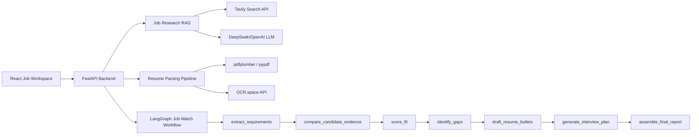

# Job Search Copilot

一个面向求职场景的 AI Agent 工作台。这个项目是我用来练习 Agent workflow、RAG、结构化输出校验和前后端集成的个人项目。

它的目标不是简单帮用户“润色简历”，而是把简历和岗位 JD 放进一个可追踪的分析流程中：先抽取岗位需求，再从简历和补充材料里检索候选人证据，最后基于证据生成简历修改建议和面试准备问题。

我重点关注两个问题：

- LLM 容易把简历写得很好看，但可能编造经历。
- 外部 API、OCR、联网搜索和 LLM 输出都不稳定，系统需要 fallback。

所以当前版本加入了 evidence retrieval、grounded resume bullets、LLM JSON schema 校验、PDF/OCR fallback 和本地 deterministic baseline。

## 架构



## 功能

### 简历与岗位分析

- JD 关键词抽取
- 简历匹配评分
- 能力缺口识别
- 面试问题生成
- 下一步优化建议

### 证据约束生成

- 从简历和补充材料中检索 evidence snippets
- 生成 bullet 时绑定 `evidence_source` 和 `evidence_snippet`
- 证据不足时提示补充，而不是编造经历

### 简历解析

- 支持 `.txt` / `.md` / `.pdf`
- layout-aware PDF 文本提取
- OCR fallback
- 解析结果人工确认

### 稳定性

- 无 API key 时使用本地 deterministic fallback
- DeepSeek / OpenAI provider 可选
- LLM JSON schema 校验与 repair
- 外部搜索不可用时降级为本地建议

## 工作流

核心分析流程被拆成多个节点：

```text
extract_requirements
-> compare_candidate_evidence
-> score_fit
-> identify_gaps
-> draft_resume_bullets
-> generate_interview_plan
-> assemble_final_report
```

当前节点默认可以使用本地逻辑运行，配置 LLM API 后会增强生成质量。这样做是为了避免项目完全依赖外部模型服务。

## 本地运行

### Backend

```powershell
cd backend
python -m venv .venv
.\.venv\Scripts\Activate.ps1
pip install -e ".[dev]"
uvicorn app.main:app --reload
```

默认 API 地址：

```text
http://127.0.0.1:8000
```

### Frontend

```powershell
cd frontend
npm install
npm run dev
```

UI 地址：

```text
http://127.0.0.1:5173
```

## 配置

复制环境变量模板：

```powershell
Copy-Item .env.example .env
```

DeepSeek：

```env
LLM_PROVIDER=deepseek
DEEPSEEK_API_KEY=your_deepseek_api_key_here
DEEPSEEK_MODEL=deepseek-v4-flash
DEEPSEEK_BASE_URL=https://api.deepseek.com
USE_LLM=true
```

OpenAI：

```env
LLM_PROVIDER=openai
OPENAI_API_KEY=your_openai_api_key_here
OPENAI_MODEL=gpt-4.1-mini
USE_LLM=true
```

OCR：

```env
OCR_SPACE_API_KEY=your_ocr_space_key_here
OCR_SPACE_ENDPOINT=https://api.ocr.space/parse/image
OCR_SPACE_ENGINE=3
OCR_MIN_TEXT_CHARS=300
```

岗位研究 RAG：

```env
TAVILY_API_KEY=your_tavily_api_key_here
TAVILY_ENDPOINT=https://api.tavily.com/search
```

## API 示例

```powershell
Invoke-RestMethod `
  -Uri "http://127.0.0.1:8000/analyze" `
  -Method Post `
  -ContentType "application/json" `
  -Body (@{
    resume_text = "Python engineer with FastAPI, React, RAG, and AI agent experience."
    job_description = "Hiring an AI Engineer with Python, FastAPI, LangGraph, and RAG experience."
    company = "ExampleCo"
    role_title = "AI Engineer"
  } | ConvertTo-Json)
```

岗位研究：

```powershell
Invoke-RestMethod `
  -Uri "http://127.0.0.1:8000/research-job" `
  -Method Post `
  -ContentType "application/json" `
  -Body (@{
    company = "ExampleCo"
    role_title = "AI Engineer"
    resume_text = "Built FastAPI and LangGraph agent workflows."
    job_description = "Need Python, FastAPI, LangGraph, RAG, and production API experience."
    supplemental_materials = "Portfolio includes OCR, LLM cleaning, and parsing evaluation."
  } | ConvertTo-Json)
```

## 开发记录

这个项目是分阶段做出来的，主要迭代包括：

- MVP：完成 FastAPI + React 的简历/JD 匹配流程。
- Agent workflow：将分析流程拆成多个 LangGraph 节点。
- Evidence retrieval：为匹配关键词检索候选人证据片段。
- PDF/OCR：支持简历上传、layout-aware PDF 解析和 OCR fallback。
- Job research RAG：接入联网岗位研究和结构化 JSON 校验。

更完整的开发记录见 `docs/changelog.md`。

## 已知限制

- 当前 evidence retrieval 主要是 lexical retrieval，对同义表达和隐含能力的识别还不够强。
- 简历解析评估样本数量有限，后续需要补充更多真实格式的 PDF。
- 当前历史记录保存在浏览器 `localStorage`，还没有用户登录和服务端持久化。
- 生成内容已经做了证据约束，但后续仍需要更细的 claim-level verification。

## 下一步计划

- 用 LlamaIndex 建立候选人资料库，接入简历、项目经历和 GitHub README。
- 将当前 lexical evidence retriever 替换或增强为 vector retrieval。
- 加入 Agent tracing、guardrails 和更系统的生成质量评估。
- 加入岗位收藏、投递状态和 follow-up 看板。

