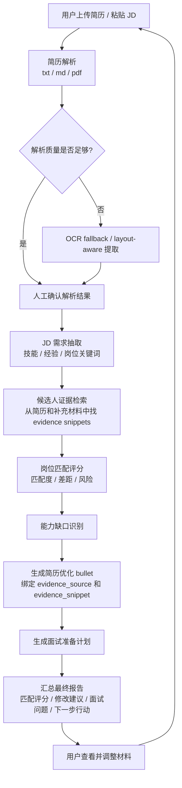
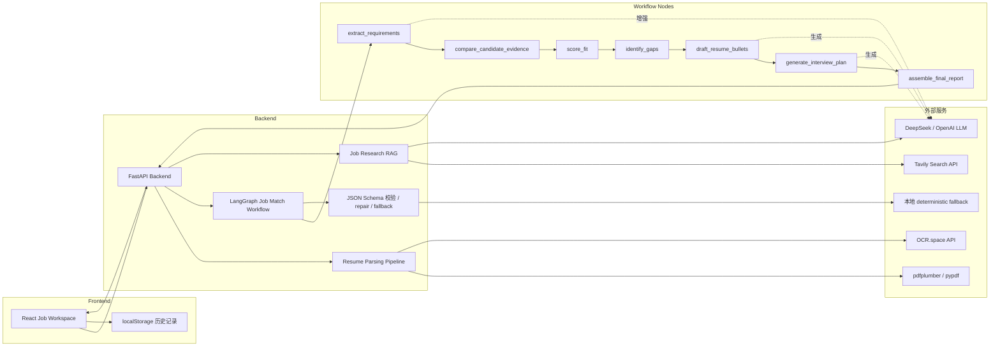
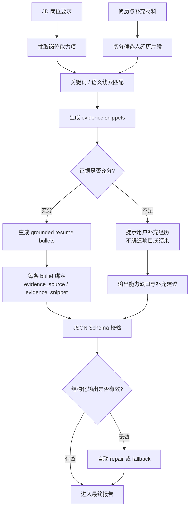

# Job Search Copilot - Architecture Diagrams

## Product Loop

```mermaid
flowchart TD
  A["用户上传简历 / 粘贴 JD"] --> B["简历解析<br/>txt / md / pdf"]
  B --> C{解析质量是否足够?}
  C -->|是| D["人工确认解析结果"]
  C -->|否| E["OCR fallback / layout-aware 提取"]
  E --> D

  D --> F["JD 需求抽取<br/>技能 / 经验 / 岗位关键词"]
  F --> G["候选人证据检索<br/>从简历和补充材料中找 evidence snippets"]
  G --> H["岗位匹配评分<br/>匹配度 / 差距 / 风险"]
  H --> I["能力缺口识别"]
  I --> J["生成简历优化 bullet<br/>绑定 evidence_source 和 evidence_snippet"]
  J --> K["生成面试准备计划"]
  K --> L["汇总最终报告<br/>匹配评分 / 修改建议 / 面试问题 / 下一步行动"]

  L --> M["用户查看并调整材料"]
  M --> A
```

## System Architecture

```mermaid
flowchart LR
  subgraph FE["Frontend"]
    UI["React Job Workspace"]
    Local["localStorage 历史记录"]
  end

  subgraph BE["Backend"]
    API["FastAPI Backend"]
    Parser["Resume Parsing Pipeline"]
    WF["LangGraph Job Match Workflow"]
    Research["Job Research RAG"]
    Guard["JSON Schema 校验 / repair / fallback"]
  end

  subgraph WFNodes["Workflow Nodes"]
    Extract["extract_requirements"]
    Compare["compare_candidate_evidence"]
    Score["score_fit"]
    Gaps["identify_gaps"]
    Draft["draft_resume_bullets"]
    Interview["generate_interview_plan"]
    Report["assemble_final_report"]
  end

  subgraph External["外部服务"]
    PDF["pdfplumber / pypdf"]
    OCR["OCR.space API"]
    Search["Tavily Search API"]
    LLM["DeepSeek / OpenAI LLM"]
    Baseline["本地 deterministic fallback"]
  end

  UI --> API
  UI --> Local
  API --> Parser
  API --> WF
  API --> Research
  Parser --> PDF
  Parser --> OCR
  Research --> Search
  Research --> LLM

  WF --> Extract --> Compare --> Score --> Gaps --> Draft --> Interview --> Report
  Extract -.增强.-> LLM
  Draft -.生成.-> LLM
  Interview -.生成.-> LLM
  WF --> Guard
  Guard --> Baseline
  Report --> API --> UI
```

## Evidence-Grounded Generation

```mermaid
flowchart TD
  A["JD 岗位要求"] --> B["抽取岗位能力项"]
  C["简历与补充材料"] --> D["切分候选人经历片段"]
  B --> E["关键词 / 语义线索匹配"]
  D --> E
  E --> F["生成 evidence snippets"]
  F --> G{证据是否充分?}

  G -->|充分| H["生成 grounded resume bullets"]
  H --> I["每条 bullet 绑定<br/>evidence_source / evidence_snippet"]

  G -->|不足| J["提示用户补充经历<br/>不编造项目或结果"]
  J --> K["输出能力缺口与补充建议"]

  I --> L["JSON Schema 校验"]
  K --> L
  L --> M{结构化输出是否有效?}
  M -->|有效| N["进入最终报告"]
  M -->|无效| O["自动 repair 或 fallback"]
  O --> N
```

